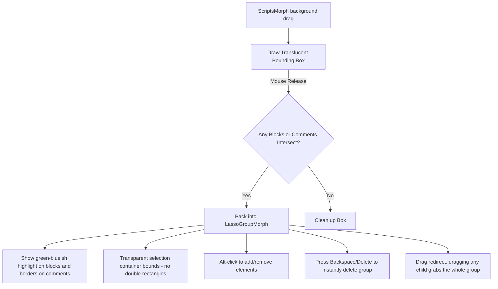

# Feature Proposal: Workspace Lasso Multi-Selection of Blocks & Comments

This document serves as a clean, structured proposal to present to the Snap! developers (on the [Snap! GitHub repository](https://github.com/jensmoenig/Snap) or the [Snap! Forums](https://forum.snap.berkeley.edu/)) for adding native lasso multi-selection into the Morphic editor core.

---

## 1. Overview & Motivation

Currently in Snap!, managing large script workspaces can be tedious because there is no built-in way to select, drag, duplicate, or delete multiple blocks or comments simultaneously. 
* **The Missing Feature:** A canvas-level click-and-drag bounding box selection (lasso).
* **The Constraint:** Shift-click is already reserved by Morphic for toggling keyboard input focus.
* **The Solution:** We propose mapping lasso selection to dragging on the empty workspace background. Combining this with **Alt-click** to toggle items in/out of the active selection and **Backspace/Delete** keys for instant group deletion creates a highly intuitive, industry-standard editor workflow.

---

## 2. UX & Design Decisions

To make the lasso selection feel like a native extension of Snap!, the implementation respects the existing aesthetic rules of Morphic:



1. **Highlight Color Matching:** The lasso bounding box and selected highlights use the standard bright green-blueish highlight theme (`Color(153, 255, 213)`).
2. **Invisible Selection Group Bounds:** Once selection is confirmed, the container group (`LassoGroupMorph`) is rendered borderless and fully transparent (`border = 0`, opacity `0`). This ensures there are no confusing double rectangles left on the screen; only the active highlight glows on blocks and comment borders are displayed.
3. **No-Popup Deletion:** Deleting selected blocks bypasses the standard confirmation dialog, allowing rapid workspace cleanup, but is safely ignored if the user is currently editing a comment or text input.
4. **Auto-Unpacking (Zero-Save Impact):** To prevent temporary group containers from contaminating project saves, the serializer automatically unpacks all `LassoGroupMorph` items into standard script structures during XML serialization (`toXML`).

---

## 3. Core Architecture

The proposal introduces a temporary wrapper morph, `LassoGroupMorph` (subclassed from `Morph`), which coordinates the group actions:

* **`LassoGroupMorph`**: Acts as a transparent proxy.
* **`rootForGrab` Redirection**: Overridden on both `Morph` and `BlockMorph` prototypes. If a clicked Morph is parented by a `LassoGroupMorph`, the grab focus is redirected to the group. Grabbing and moving any block inside the selection naturally moves the entire group.
* **`contextMenu` Redirection**: Right-clicking any selected element redirects to the group's custom menu (supporting **duplicate** and **delete** on the entire selection).
* **Alt key tracking**: `HandMorph` tracks the state of the Option/Alt key globally. Clicking a block/comment while holding Alt toggles its inclusion in the active selection, dynamically shrinking or expanding the group bounds.

---

## 4. Code Modifications (Diffs)

The following clean diffs demonstrate how easily this feature integrates into the Snap! codebase:

### D1. Hand Events (Option/Alt Key Tracking)
In `src/morphic.js`:
```diff
--- src/morphic.js
+++ src/morphic.js
@@ -11595,2 +11595,4 @@
 HandMorph.prototype.processMouseUp = function (event) {
+    var ev = event || arguments[0] || {};
+    this.altPressed = ev.altKey || false;
     var morph = this.inputTarget || this.morphAtPointer(),
```

### D2. Keyboard Events (Global Delete Key Binding)
In `src/morphic.js` inside `KeyboardReceiverMorph.prototype.processKeyDown`:
```diff
--- src/morphic.js
+++ src/morphic.js
@@ -12386,2 +12386,18 @@
             if (event.keyCode === 8 || event.keyCode === 46) {
+                var focus = kbd.world.keyboardFocus;
+                var isEditingText = focus && (
+                    focus instanceof CursorMorph ||
+                    (typeof ScriptFocusMorph !== 'undefined' && focus instanceof ScriptFocusMorph) ||
+                    focus.isEditable === true ||
+                    (focus.parent && focus.parent.isEditable === true)
+                );
+                if (!isEditingText && typeof LassoGroupMorph !== 'undefined') {
+                    var ide = kbd.world.children[0];
+                    if (ide && ide.currentSprite && ide.currentSprite.scripts) {
+                        var scripts = ide.currentSprite.scripts;
+                        var groups = scripts.children.filter(child => child instanceof LassoGroupMorph);
+                        if (groups.length > 0) {
+                            event.preventDefault();
+                            groups.forEach(group => group.confirmDelete());
+                            return;
+                        }
+                    }
+                }
```

### D3. Serialization Guard (Unpacking before Saving)
In `src/store.js`:
```diff
--- src/store.js
+++ src/store.js
@@ -2630,2 +2630,6 @@
 ScriptsMorph.prototype.toXML = function (serializer) {
+    if (typeof LassoGroupMorph !== 'undefined') {
+        this.children.filter(child => child instanceof LassoGroupMorph)
+            .forEach(group => group.unpack());
+    }
     return this.children.reduce((xml, child) => {
```

### D4. Blocks & Scripts Event Overrides (The Lasso Logic)
In `src/blocks.js`:
* Add lasso dragging handlers to `ScriptsMorph`:
```javascript
ScriptsMorph.prototype.mouseDownLeft = function (pos) {
    var shiftClicked = this.world().currentKey === 16;
    if (shiftClicked) {
        return; // default Shift-click edit action
    }

    var groups = this.children.filter(child => child instanceof LassoGroupMorph);
    if (groups.length > 0) {
        groups.forEach(group => group.unpack());
        this.changed();
        return;
    }

    if (this.focus) { this.focus.stopEditing(); }

    this.lassoStart = pos;
    this.lassoFeedback = new BoxMorph();
    this.lassoFeedback.color = new Color(153, 255, 213, 0.12);
    this.lassoFeedback.borderColor = new Color(153, 255, 213, 0.85);
    this.lassoFeedback.border = 2;
    this.lassoFeedback.setPosition(pos);
    this.lassoFeedback.setExtent(new Point(0, 0));
    this.add(this.lassoFeedback);
    this.lockMouseFocus();
};

ScriptsMorph.prototype.mouseMove = function (pos) {
    if (this.lassoStart && this.lassoFeedback) {
        var rect = this.lassoStart.rectangle(pos);
        this.lassoFeedback.changed();
        this.lassoFeedback.bounds = rect;
        this.lassoFeedback.changed();
    }
};

ScriptsMorph.prototype.mouseClickLeft = function (pos) {
    var shiftClicked = this.world().currentKey === 16;
    if (shiftClicked) { return; }
    if (this.focus) { this.focus.stopEditing(); }

    if (this.lassoStart && this.lassoFeedback) {
        var rect = this.lassoFeedback.bounds;
        this.lassoFeedback.destroy();
        this.lassoFeedback = null;
        this.lassoStart = null;

        if (rect.width() < 5 || rect.height() < 5) return;

        var selected = [];
        this.children.forEach(child => {
            if ((child instanceof BlockMorph || child instanceof CommentMorph) &&
                child.bounds.intersects(rect)) {
                selected.push(child);
            }
        });

        if (selected.length > 0) {
            var left = Infinity, top = Infinity, right = -Infinity, bottom = -Infinity;
            selected.forEach(morph => {
                left = Math.min(left, morph.left());
                top = Math.min(top, morph.top());
                right = Math.max(right, morph.right());
                bottom = Math.max(bottom, morph.bottom());
            });

            var group = new LassoGroupMorph();
            group.bounds = new Rectangle(left - 4, top - 4, right + 4, bottom + 4);
            selected.forEach(child => group.add(child));
            this.add(group);
            this.changed();
        }
    }
};
```

* Add the new `LassoGroupMorph` container class definition at the bottom of `src/blocks.js`.
